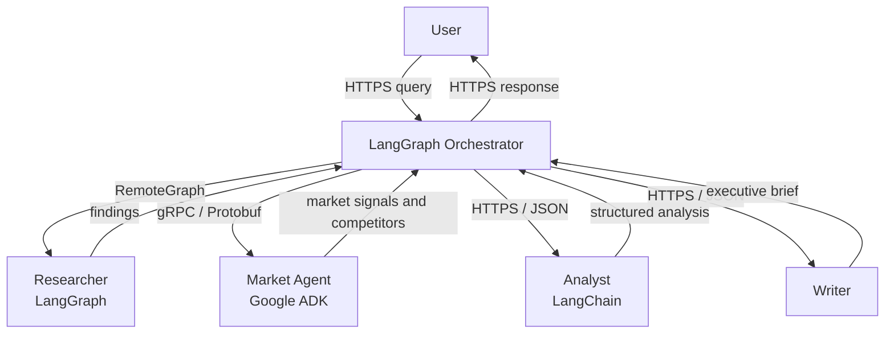
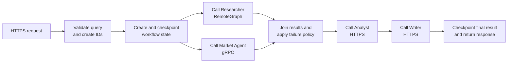
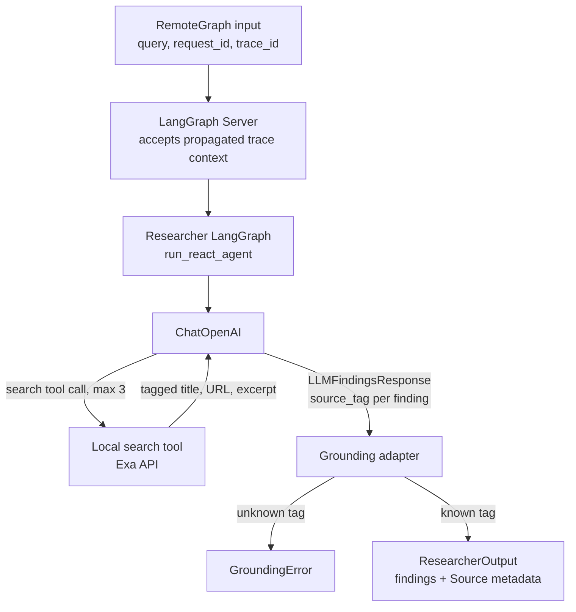
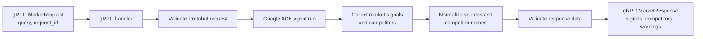
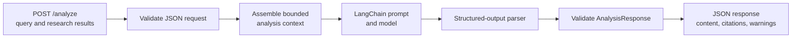
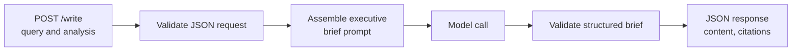

# Architecture

## Architectural Principle

LangGraph is the orchestration layer, not the application container for every
agent. The orchestrator owns workflow sequencing, routing, state transitions,
and recovery. Each agent service owns its domain reasoning, prompts, models,
tools, and internal implementation.



Only the orchestrator advances the top-level workflow. Arrows between agents
represent data flow, not agent-to-agent orchestration.

## Workflow Graph

```text
START
  |
  +--> call_researcher ----+
  |                        |
  +--> call_market --------+--> join --> call_analyst --> call_writer --> END
```

The first two nodes run concurrently. The join evaluates the result of both
branches and determines whether to proceed normally, proceed with a degraded
input, or terminate the workflow. Analyst and Writer then run sequentially.

## Service Boundaries and Communication

| Service | Suggested implementation | Transport | Why it exists in the demo |
| --- | --- | --- | --- |
| Orchestrator | Python + LangGraph StateGraph | Inbound HTTPS; outbound clients | Shows a workflow control plane separate from agents. |
| Researcher | Python + LangGraph | Remote agent | Demonstrates that a LangGraph agent can be exposed through Remote Agent |
| Market Agent | Python + Google ADK | gRPC | Demonstrates an independently implemented gRPC agent with a different agent framework. |
| Analyst | Python + LangChain | HTTPS / JSON | Demonstrates a LangChain agent behind a framework-independent HTTP contract. |
| Writer | Python HTTP service; any agent framework | HTTPS / JSON | Demonstrates a final independent capability. |

The Researcher is invoked through LangGraph `RemoteGraph` as the remote-agent
mechanism. Its deployment must implement the LangGraph Server API; a generic
containerized LangGraph application is not sufficient. Market Agent uses a
versioned gRPC contract, while Analyst and Writer use versioned HTTPS/JSON
contracts. The orchestrator therefore remains dependent on service contracts,
not a shared agent framework.

## Agent Responsibilities

### Researcher

- Accepts a query and returns a bounded list of general findings.
- Each finding contains `title`, `claim`, and source metadata.
- In live mode, uses a bounded ReAct loop: the model chooses whether to call
  its local Exa `search` tool, up to three times, before submitting structured
  findings.
- Grounds every finding against a source tag returned by that tool; the
  service—not the model—constructs the final `Source` objects.
- Does not perform market synthesis or brief writing.
- Is deployed as a LangGraph Server API-compatible remote agent.

### Market Agent

- Accepts the same query independently of Researcher.
- Returns market signals and a normalized competitor list.
- Uses Google ADK for its internal agent behaviour.
- Does not depend on Researcher output.
- Exposes a versioned Protobuf gRPC contract.

### Analyst

- Accepts the query plus validated Researcher and Market outputs.
- Produces `content` (a detailed markdown analysis, uncapped in length) and
  `citations` (title/url/publisher for each source cited inline), plus
  `warnings`.
- Uses LangChain for its internal analysis chain or agent behaviour.
- Does not call Writer directly.

### Writer

- Accepts only Analyst's markdown `analysis` and its `citations`, not raw
  research data.
- Produces `content` (a detailed markdown executive brief, uncapped in
  length) and `citations`.
- Does not perform further research or market analysis.

## Simple Internal Architecture

Each service has one public boundary, a small internal execution flow, and a
schema-validated response. No agent calls another agent directly.

### Orchestrator: LangGraph StateGraph



The graph state contains the query, request and trace identifiers, branch
statuses, warnings, and bounded result data or result references. The
orchestrator does not contain research prompts, market logic, analysis logic,
or writing prompts.

### Researcher: LangGraph Remote Agent



The public RemoteGraph contract remains deliberately small:

```text
ResearcherInput(query, request_id, trace_id, attempt, deadline)
  -> ResearcherOutput(findings[], warnings[], status, error)
```

`AI_MODE=fixture` bypasses the live loop and returns deterministic findings.
In `AI_MODE=live`, the compiled graph has one service-owned
`run_react_agent` node whose LangChain agent performs the model → tool → model
loop. The tool builds opaque tags in the form `{tool_call_id}#{position}`. The
model may cite only those tags; after the loop, the service scans tool messages,
maps cited tags back to Exa results, and rejects unknown references. This keeps
model text from becoming trusted source metadata.

For observability, the Orchestrator propagates LangSmith context through
`RemoteGraph`; the LangGraph Server continues it as the `researcher` child run:

```text
orchestrator.workflow
└─ call_researcher
   └─ researcher
      └─ run_react_agent
         ├─ model
         ├─ tools
         │  └─ search
         └─ model
```

### Market Agent: Google ADK gRPC Service



The gRPC handler is deliberately thin: it converts the Protobuf contract into
the Google ADK agent input and converts validated agent output back into the
Protobuf response. Its run context is private to the service and is not part
of the Orchestrator state.

### Analyst: LangChain HTTPS Service



The Analyst is a single service boundary. Its LangChain chain may contain only
one analysis prompt and one structured-output step for the demo. It consumes
the two upstream outputs but never invokes Writer itself. The model cites
sources with bare `[N]` markers against a numbered source list already
built from trusted data — there's no field for it to put a URL in, so it
can't invent one. Code rewrites each `[N]` into a real markdown link
(`render_citation_links`, shared via `packages/contracts`).

### Writer: HTTPS Service



Writer is deliberately a presentation transformation. It cannot call research
tools or receive raw findings; its only source of facts is the validated
analysis supplied by the Orchestrator.

## Contracts

Every public agent contract includes the following envelope fields:

```text
contract_version
request_id
trace_id
attempt
deadline
```

Every response includes:

```text
request_id
status              # success | degraded | failed
data                # agent-specific, schema-validated output
warnings[]
error_code          # present only for failed responses
```

`request_id` correlates the logical workflow and supports idempotent handling;
`trace_id` is propagated to logs and tracing. Contracts must be validated at
the service boundary. The orchestrator relies on the contract only, never an
agent's prompt, model provider, tools, or private state.

## State and Data Ownership

The orchestrator owns the top-level workflow state and checkpoints it after
meaningful transitions. Agents own only their internal execution state.

For this small demo, validated output may be held in graph state. The state is
still bounded. A production extension should put large documents, raw tool
responses, and embeddings in durable storage and pass references instead:

```text
request_id
query
research_result_ref
market_result_ref
analysis_result_ref
workflow_status
```

This keeps checkpointing and service-boundary payloads small while allowing a
failed orchestrator replica to resume from a durable checkpoint.

## Failure Policy

| Agent | Timeout/retry policy | Join behaviour |
| --- | --- | --- |
| Researcher | Bounded timeout; retry transient failures with exponential backoff. | A final failure produces a degraded input with a warning. |
| Market Agent | Bounded timeout; retry transient failures with exponential backoff. | A final failure produces a degraded input with a warning. |
| Analyst | Bounded timeout; retry only safe transient failures. | Final failure terminates the workflow. |
| Writer | Bounded timeout; retry only safe transient failures. | Final failure terminates the workflow. |

The join may continue only when at least one of Researcher or Market Agent has
produced usable, validated data. If both fail, the workflow terminates with a
clear error. Retries must use the same idempotency key and must not duplicate
an externally visible side effect.

## Observability and Security Requirements

- Emit structured logs with `request_id`, `trace_id`, agent name, attempt,
  latency, status, and error code.
- Propagate one trace across the parent graph and all remote calls; use
  LangSmith where configured for LangGraph tracing and Cloud Logging for all
  service logs.
- Authenticate every service-to-service call. No agent endpoint is public by
  default.
- Record only safe metadata in logs; do not log unredacted prompts, tokens, or
  sensitive raw research data by default.
