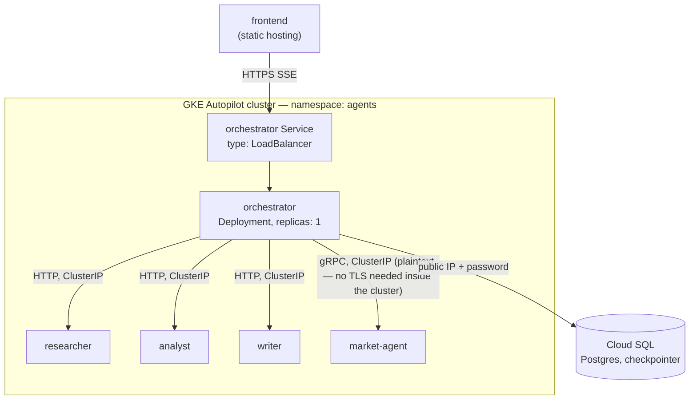

# Deployment — Kubernetes (GKE Autopilot, simple)

An alternative to [`deployment.md`](./deployment.md) using GKE instead of
Cloud Run. Same simplicity goal — a single person should be able to stand
this up and tear it down without prior Kubernetes-in-this-repo setup — but
the deploy target is a K8s cluster instead of five independent Cloud Run
services. **Still no IAM-gated service-to-service auth** and, new here,
**no NetworkPolicy either**: any Pod in the namespace can call any other
Pod. That is the direct K8s equivalent of the Cloud Run demo plan's
`allow_public_access = true` simplification — network isolation is future
hardening, not implemented here.

## Why GKE Autopilot, not Standard

Autopilot bills per-Pod resource request and manages nodes for you — no node
pool sizing, no OS patching. Standard gives more knobs (custom node
machine types, DaemonSets, etc.) that this project doesn't need. Autopilot
still requires every container to declare `resources.requests` — that's not
optional the way Cloud Run's cpu/memory defaults are, so the manifests below
set small explicit requests.

## Topology



The one genuine win over the Cloud Run plan: market-agent's gRPC call no
longer needs `MARKET_AGENT_USE_TLS` or the `https://`-stripping address
hack. Inside a cluster, a plain `ClusterIP` Service talks plaintext gRPC —
Cloud Run's forced TLS-at-ingress doesn't apply here.

## What each service needs

Same ports, secrets, and app-level env vars as the
[Cloud Run demo plan](./deployment.md#what-each-service-needs) — this
section only covers what's different in how they're delivered.

| | Cloud Run demo plan | This plan |
|---|---|---|
| Compute unit | Cloud Run service | Deployment (`replicas: 1`) + ClusterIP Service |
| Config injection | Terraform `env_vars`/`secret_env_vars` on the Cloud Run resource | K8s `ConfigMap` (plain vars) + `Secret` (API keys, `CHECKPOINT_DATABASE_URL`) mounted as env |
| Public ingress (orchestrator only) | Cloud Run's own `https://*.run.app` | `type: LoadBalancer` Service (plain HTTP — see caveat below) |
| Cloud SQL access | Cloud Run's built-in unix-socket connector | Direct `host:port` connection to Cloud SQL's public IP — GKE has no free built-in connector, so this is the actual "simple" equivalent (see hardening note) |
| gRPC to market-agent | TLS required, forced by Cloud Run ingress | Plaintext, `ClusterIP` DNS (`market-agent.agents.svc.cluster.local:50051`) |
| Self-healing / restart | Cloud Run manages this itself | The Deployment controller — never create a bare `Pod` object, always a Deployment even at `replicas: 1` |

## Cluster + Cloud SQL (Terraform sketch)

Not implemented under `infra/` yet — same "plan, not code" scope as the
production Cloud Run variant.

```hcl
resource "google_container_cluster" "agents" {
  name             = "agents-cluster"
  location         = var.region
  enable_autopilot = true
}
```

Cloud SQL: reuse `services/orchestrator/infra/modules/cloud_sql`, but its
current `database_url` output assumes Cloud Run's unix-socket path
(`/cloudsql/<connection_name>`) — for GKE you'd want a variant output using
the instance's public IP instead:

```hcl
output "database_url_public" {
  value     = "postgresql://${var.database_user}:${random_password.db.result}@${google_sql_database_instance.this.public_ip_address}:5432/${var.database_name}?sslmode=require"
  sensitive = true
}
```

## Kubernetes manifests (pattern, illustrated for `analyst` and `orchestrator`)

```yaml
apiVersion: v1
kind: Namespace
metadata:
  name: agents
---
apiVersion: v1
kind: ConfigMap
metadata:
  name: analyst-config
  namespace: agents
data:
  AI_MODE: "live"
  OPENAI_MODEL: "gpt-4o-mini"
  LLM_TIMEOUT_SECONDS: "30"
  LANGSMITH_TRACING: "true"
  LANGSMITH_PROJECT: "distributed-agents-demo"
---
apiVersion: apps/v1
kind: Deployment
metadata:
  name: analyst
  namespace: agents
spec:
  replicas: 1
  selector:
    matchLabels: { app: analyst }
  template:
    metadata:
      labels: { app: analyst }
    spec:
      containers:
        - name: analyst
          image: asia-southeast1-docker.pkg.dev/PROJECT/analyst/analyst:latest
          ports: [{ containerPort: 8002 }]
          envFrom:
            - configMapRef: { name: analyst-config }
            - secretRef: { name: analyst-secrets }
          resources:
            requests: { cpu: "250m", memory: "256Mi" }
          readinessProbe:
            httpGet: { path: /ready, port: 8002 }
---
apiVersion: v1
kind: Service
metadata:
  name: analyst
  namespace: agents
spec:
  selector: { app: analyst }
  ports: [{ port: 8002, targetPort: 8002 }]
```

`writer`, `researcher`, `market-agent` follow the same shape (researcher's
readiness probe hits `/ok`; market-agent has no HTTP probe — use
`readinessProbe.tcpSocket` on 50051 instead). Orchestrator differs only in
its Service type and in referencing the other four by ClusterIP DNS name:

```yaml
apiVersion: v1
kind: ConfigMap
metadata:
  name: orchestrator-config
  namespace: agents
data:
  RESEARCHER_URL: "http://researcher.agents.svc.cluster.local:8001"
  ANALYST_URL: "http://analyst.agents.svc.cluster.local:8002"
  WRITER_URL: "http://writer.agents.svc.cluster.local:8003"
  MARKET_AGENT_ADDRESS: "market-agent.agents.svc.cluster.local:50051"
  MARKET_AGENT_USE_TLS: "false"
---
apiVersion: v1
kind: Service
metadata:
  name: orchestrator
  namespace: agents
spec:
  type: LoadBalancer
  selector: { app: orchestrator }
  ports: [{ port: 80, targetPort: 8000 }]
```

Secrets are created once by hand, mirroring the `gcloud secrets versions
add` step from the Cloud Run plan:

```bash
kubectl create secret generic analyst-secrets -n agents \
  --from-literal=OPENAI_API_KEY=sk-... \
  --from-literal=LANGSMITH_API_KEY=lsv2_...

kubectl create secret generic orchestrator-secrets -n agents \
  --from-literal=CHECKPOINT_DATABASE_URL=postgresql://... \
  --from-literal=LANGSMITH_API_KEY=lsv2_...
```

## Caveat: `LoadBalancer` is plain HTTP

A bare `type: LoadBalancer` Service gets you an external IP fast, but it's
unencrypted HTTP on that IP — no TLS. If the frontend is served over HTTPS
(likely, on any static host), browsers will block calls to a plain-HTTP
orchestrator as mixed content. For a same-machine/local-network demo this is
fine; to wire it to a real HTTPS-hosted frontend, swap the Service for a GKE
`Ingress` + `ManagedCertificate` (needs a reserved static IP and a domain
pointed at it) — that's the next step up, not sketched here.

## Deployment order

1. `terraform apply` the GKE Autopilot cluster and Cloud SQL instance.
2. Build and push all 5 images to Artifact Registry (same per-service repos
   as the Cloud Run plan — nothing about the images changes).
3. `kubectl apply` the namespace, then Secrets, then ConfigMaps.
4. `kubectl apply` researcher/analyst/writer/market-agent Deployments +
   Services; wait for `kubectl get pods -n agents` to show all Ready.
5. `kubectl apply` orchestrator's Deployment + Service; `kubectl get svc -n
   agents orchestrator` to get its external IP.
6. Point the frontend's `VITE_ORCHESTRATOR_BASE_URL` at that IP (or the
   Ingress hostname, if you added one).

## Simplifications vs. a production GKE setup

- **No NetworkPolicy.** Every Pod in the `agents` namespace can reach every
  other Pod. A hardened setup would add `NetworkPolicy` objects restricting
  ingress to each downstream service to just the orchestrator's Pod
  label — the K8s analog of the Cloud Run production plan's
  `ingress: INTERNAL_ONLY`.
- **No Workload Identity / Cloud SQL Auth Proxy.** The orchestrator connects
  to Cloud SQL's public IP with a plain username/password, the same way the
  local `docker-compose` setup does. A hardened setup would use a Cloud SQL
  Auth Proxy sidecar authenticated via Workload Identity (a GCP IAM binding
  for the Pod's service account) instead of a public IP + password — that's
  IAM for the Pod-to-Cloud-SQL leg specifically, a different thing from the
  service-to-service auth this plan still skips.
- **`replicas: 1`, no HPA.** Fixed replica count, no autoscaling. Add a
  `HorizontalPodAutoscaler` per service if traffic needs it.
- **Single namespace, no RBAC.** All 5 services share one namespace with no
  per-service RBAC boundaries.
- **Plain `LoadBalancer`, no managed TLS.** See the caveat above.

## Note

Not run through `terraform validate`/`plan` or `kubectl apply --dry-run`
(neither `terraform` nor a cluster is available in this environment) —
validate both before applying, and expect to iterate on resource
requests/limits and probe timing once real Pods are actually starting.
