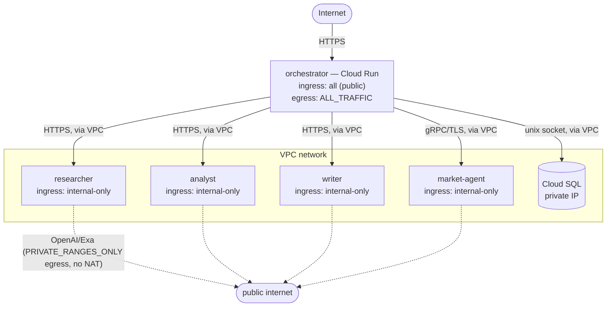

# Deployment — production-like (VPC-isolated)

This is a hardened variant of [`deployment.md`](./deployment.md): the four
downstream services and Cloud SQL move behind a VPC and stop being reachable
from the public internet. Per-service config (ports, secrets, env vars),
deployment order, and Terraform module layout are unchanged from the demo
plan — read that first. This document only covers the delta.

**Still no IAM-gated service-to-service auth**, by design. The security
improvement here is entirely at the network layer (nothing reachable from
outside the VPC can be reached at all), not at the identity layer (nothing
here checks *who* is calling). A caller inside the VPC — or another
same-project Cloud Run service, see the caveat below — is trusted. Anyone
wanting per-caller identity checks on top of this still needs the
ID-token/`roles/run.invoker` work called out as out-of-scope in the demo plan.

## Topology



Orchestrator is still the one public entry point (the frontend has to reach
it from outside GCP). The four downstream services and the database drop
their public IPs/ingress entirely.

## What changes vs. the demo plan

| | Demo plan | Production-like plan |
|---|---|---|
| researcher/analyst/writer/market-agent reachability | Public `https://*.run.app`, `allow_public_access = true` | `ingress = "INGRESS_TRAFFIC_INTERNAL_ONLY"` — unreachable from the public internet |
| How orchestrator reaches them | Public URL over the internet | Same public URL/hostname, but the call is routed over the VPC via Direct VPC egress, never leaving Google's internal network |
| Cloud SQL | Public IP, reached via Cloud Run's Cloud SQL Auth Proxy connector (unix socket) | Private IP only (`ipv4_enabled = false`), reached the same way (the connector works with private IP too) over the VPC |
| New resources | — | `google_compute_network`, `google_compute_subnetwork`, Private Services Access peering (`google_compute_global_address` + `google_service_networking_connection`) for Cloud SQL's private IP |
| Outbound internet (OpenAI/Exa) from downstream services | Direct, no VPC involved | Still direct — `egress = PRIVATE_RANGES_ONLY` on those services sends only RFC1918-bound traffic through the VPC and lets everything else (OpenAI, Exa, Secret Manager) go out normally, so no Cloud NAT is required |

## New Terraform resources (sketch)

Not implemented in `infra/` yet — this is the shape of what each piece needs.
A shared `network` module, created once (e.g. under a new
`infra/shared/network/` outside any single service, since it's cross-service
infrastructure):

```hcl
resource "google_compute_network" "vpc" {
  name                    = "agents-vpc"
  auto_create_subnetworks = false
}

resource "google_compute_subnetwork" "run" {
  name          = "agents-run-subnet"
  region        = var.region
  network       = google_compute_network.vpc.id
  ip_cidr_range = "10.10.0.0/24"  # Direct VPC egress: size for one IP per
                                  # active Cloud Run instance across all
                                  # services, with headroom for scaling.
}

# Private Services Access, so Cloud SQL can get a private IP on this VPC.
resource "google_compute_global_address" "sql_peering_range" {
  name          = "sql-peering-range"
  purpose       = "VPC_PEERING"
  address_type  = "INTERNAL"
  prefix_length = 16
  network       = google_compute_network.vpc.id
}

resource "google_service_networking_connection" "sql_peering" {
  network                 = google_compute_network.vpc.id
  service                 = "servicenetworking.googleapis.com"
  reserved_peering_ranges = [google_compute_global_address.sql_peering_range.name]
}
```

Each Cloud Run service (`cloud_run_service` module) gains a `vpc_access`
block:

```hcl
# downstream services (researcher, analyst, writer, market-agent)
template {
  vpc_access {
    network_interfaces {
      network    = var.vpc_network
      subnetwork = var.vpc_subnetwork
    }
    egress = "PRIVATE_RANGES_ONLY"
  }
  ...
}

resource "google_cloud_run_v2_service" "this" {
  ingress = "INGRESS_TRAFFIC_INTERNAL_ONLY"
  ...
}
```

```hcl
# orchestrator only
template {
  vpc_access {
    network_interfaces {
      network    = var.vpc_network
      subnetwork = var.vpc_subnetwork
    }
    egress = "ALL_TRAFFIC"  # only targets are the 4 internal services and
                             # Cloud SQL, both inside the VPC — safe to force
                             # everything through it. If orchestrator ever
                             # calls an external API directly, switch this to
                             # PRIVATE_RANGES_ONLY (or add Private Google
                             # Access) so that call isn't broken.
    }
  }
}

resource "google_cloud_run_v2_service" "this" {
  ingress = "INGRESS_TRAFFIC_ALL"
  ...
}
```

Cloud SQL drops its public IP:

```hcl
resource "google_sql_database_instance" "this" {
  ...
  settings {
    ip_configuration {
      ipv4_enabled    = false
      private_network = var.vpc_network
    }
  }
  depends_on = [google_service_networking_connection.sql_peering]
}
```

`allow_public_access` on the `cloud_run_service` module (currently just
`roles/run.invoker` → `allUsers`) becomes meaningless for the four downstream
services once `ingress = INTERNAL_ONLY` — internal-only ingress already
rejects public-internet callers before an IAM check would even run, so drop
that flag for them rather than leaving a dead public IAM binding in place.

## Caveat: same-project trust on internal ingress

Cloud Run's `INTERNAL_ONLY` ingress accepts traffic connected via the VPC
*and* traffic from other Cloud Run/Cloud Functions services in the same
project, regardless of whether the caller itself has VPC egress configured.
In practice this means the orchestrator could likely reach the four
downstream services on internal ingress even without its own
`vpc_access` block, purely by same-project trust. This plan attaches the
orchestrator to the VPC anyway — for the write path (Cloud SQL, which does
require VPC connectivity) and because relying on the VPC as the actual
transport, rather than an incidental same-project trust rule, is closer to
what "communicate over the VPC" should mean. Confirm this behavior against
current Cloud Run docs before relying on it; it's the kind of platform detail
that has shifted over past releases.

If the goal is to *also* close the same-project gap — e.g. so no other
service that happens to land in this project, now or later, can reach these
four — the next step up is **VPC Service Controls** (a perimeter around the
project) or a **Private Service Connect** interface for each service. Neither
is sketched here; both are a meaningful step past "simple," and still
wouldn't add identity-based auth, just a stricter network boundary.

## Everything else

Ports, secrets (still human-seeded via `gcloud secrets versions add`,
`CHECKPOINT_DATABASE_URL` still Terraform-generated), deployment order, and
the `iam`/`observability`-module-free, `langgraph dev`-runner simplifications
are all unchanged from [`deployment.md`](./deployment.md).

## Note

None of this has been run through `terraform validate`/`terraform plan` —
`terraform` isn't installed in this environment, and Direct VPC egress /
Private Services Access have enough version- and quota-sensitive detail
(subnet sizing, API enablement for `servicenetworking.googleapis.com`,
`vpc-access.googleapis.com`) that this should be validated against current
provider docs before it's implemented, more so than the demo plan.
