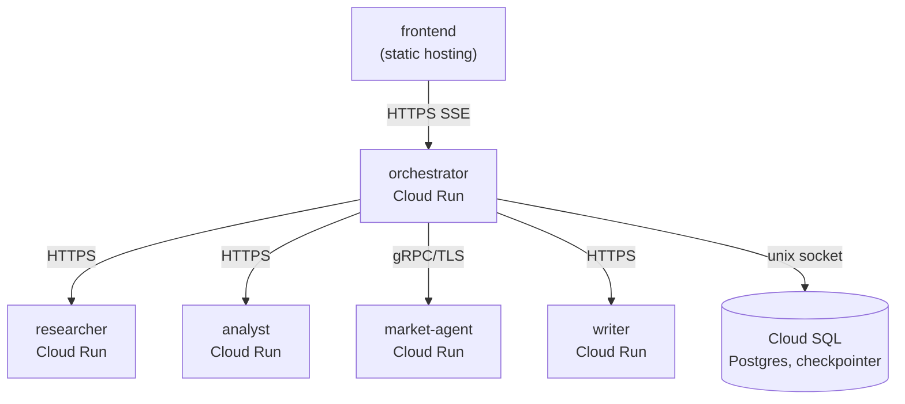

# Deployment

Each service under `services/*/infra/` deploys independently to Cloud Run
with its own Terraform. This is a simple, demo-scoped plan — it trades away
some production hardening for something that a single person can stand up
and tear down quickly. The trade-offs are called out explicitly below.

Two variants of this plan:

- [`deployment-production.md`](./deployment-production.md) — same Cloud Run
  target, hardened by putting the four downstream services and Cloud SQL
  behind a VPC (still no IAM-gated auth — see that document's own caveats).
- [`deployment-k8s.md`](./deployment-k8s.md) — same simplicity goal, but on
  GKE Autopilot instead of Cloud Run.

## Topology



Every service is its own Cloud Run service, its own Artifact Registry
repository, its own service account, and its own Terraform state — deploying
one never requires touching another's code or state.

## Communication between services

- **Orchestrator → researcher / analyst / writer**: plain HTTPS. Cloud Run
  gives every service a public `https://*.run.app` URL; the orchestrator is
  just handed those URLs as Terraform input variables.
- **Orchestrator → market-agent**: gRPC, but over TLS. Cloud Run always
  terminates TLS at its ingress — there is no plaintext option — so
  `MARKET_AGENT_USE_TLS=true` and the address is derived by stripping the
  `https://` scheme from market-agent's URL and appending `:443`
  (`services/orchestrator/infra/environments/dev/main.tf`, `local.market_agent_address`).
  On the receiving side, market-agent sets `use_http2 = true`, which names
  its container port `h2c`. Both halves are required: gRPC needs end-to-end
  HTTP/2, and without the `h2c` port name Cloud Run terminates TLS and then
  speaks HTTP/1.1 to the container, so the gRPC server never answers.
- **Orchestrator → Cloud SQL**: Cloud Run's built-in Cloud SQL connector
  (a unix socket at `/cloudsql/<connection_name>`), not a VPC connector.
  Simpler to wire and sufficient at demo scale. The runtime service account
  needs `roles/cloudsql.client` for this connector to work — without it the
  socket never comes up and the app fails at startup with `connection to
  server on socket ".../cloudsql/..." failed: Connection refused`
  (`services/orchestrator/infra/environments/dev/main.tf`,
  `google_project_iam_member.cloudsql_client`).
- **Frontend → orchestrator**: plain HTTPS from wherever the frontend is
  hosted, driven by `VITE_ORCHESTRATOR_BASE_URL` pointed at the
  orchestrator's Cloud Run URL.

## GCP services used

| Component | GCP services it needs |
|---|---|
| researcher | Cloud Run · Artifact Registry · Secret Manager |
| analyst | Cloud Run · Artifact Registry · Secret Manager |
| writer | Cloud Run · Artifact Registry · Secret Manager |
| market-agent | Cloud Run · Artifact Registry · Secret Manager |
| orchestrator | Cloud Run · Artifact Registry · Secret Manager · **Cloud SQL** (Postgres, checkpointer) |
| frontend | Any static host — not modeled in this repo's Terraform |

Four GCP services in total: **Cloud Run** (hosts all 5 backend services),
**Artifact Registry** (one Docker repo per service), **Secret Manager**
(API keys plus the Terraform-generated `CHECKPOINT_DATABASE_URL`), and
**Cloud SQL** (orchestrator only, for the LangGraph checkpointer). IAM
(service accounts + `roles/run.invoker` / `roles/secretmanager.secretAccessor`
bindings) is provisioned by the Terraform in this repo, but the underlying
APIs must be enabled once per project before the first `apply`:

```bash
gcloud services enable \
  run.googleapis.com \
  artifactregistry.googleapis.com \
  secretmanager.googleapis.com \
  sqladmin.googleapis.com
```

## What each service needs

| Service | Port | Secrets | Notable env vars | Health probe |
|---|---|---|---|---|
| researcher | 8001 (HTTP) | `OPENAI_API_KEY`, `EXA_API_KEY`, `LANGSMITH_API_KEY` | `EXA_MAX_RESULTS`, `EXA_CONTENT_MAX_CHARACTERS`, `LLM_TIMEOUT_SECONDS` | `/ok` (LangGraph Server) |
| analyst | 8002 (HTTP) | `OPENAI_API_KEY`, `LANGSMITH_API_KEY` | `OPENAI_MODEL`, `LLM_TIMEOUT_SECONDS` | `/ready` |
| writer | 8003 (HTTP) | `OPENAI_API_KEY`, `LANGSMITH_API_KEY` | `OPENAI_MODEL`, `LLM_TIMEOUT_SECONDS` | `/ready` |
| market-agent | 50051 (gRPC) | `OPENAI_API_KEY`, `EXA_API_KEY`, `LANGSMITH_API_KEY` | `EXA_MAX_RESULTS`, `EXA_CONTENT_MAX_CHARACTERS`, `LLM_TIMEOUT_SECONDS` | TCP (no HTTP path) |
| orchestrator | 8000 (HTTP) | `CHECKPOINT_DATABASE_URL` (Terraform-generated), `LANGSMITH_API_KEY` | `RESEARCHER_URL`, `ANALYST_URL`, `WRITER_URL`, `MARKET_AGENT_ADDRESS`, `MARKET_AGENT_USE_TLS`, `ORCHESTRATOR_ALLOWED_ORIGINS` | `/ready` |

API-key secrets (`OPENAI_API_KEY`, `EXA_API_KEY`, `LANGSMITH_API_KEY`) are
created as empty Secret Manager containers by each service's own Terraform
and must be seeded once by hand (`gcloud secrets versions add ...` — see each
service's `infra/README.md`). `CHECKPOINT_DATABASE_URL` is the one exception:
Terraform generates the Cloud SQL password itself (`random_password` inside
`services/orchestrator/infra/modules/cloud_sql`), so it writes that secret's
value directly — nothing to seed by hand there.

**Secret IDs are prefixed per service** (`analyst-OPENAI_API_KEY`,
`writer-OPENAI_API_KEY`, …) via the `name_prefix` input on the `secrets`
module. Secret Manager IDs are unique per project, so without the prefix the
second service to deploy into a shared project would fail to create
`OPENAI_API_KEY` with an `AlreadyExists` error. The prefix keeps each
service's Terraform independent — no shared bootstrap, no ordering
constraint between services — at the cost of seeding the same upstream API
key once per service. Inside the container the env var is still plain
`OPENAI_API_KEY`; only the Secret Manager resource name carries the prefix.

## Deployment order

### Per service: a two-phase apply

A single `terraform apply` from scratch **cannot** work, and this is not a
quirk of this repo — a Cloud Run service can only be created once the things
it references already exist:

- its container image must already be in Artifact Registry, and
- every secret it mounts must already have at least one version. The module
  mounts `version = "latest"`, and a revision referencing a secret with zero
  versions fails to become ready.

Both of those depend on resources Terraform creates in the same run, so the
repo (and the image build) has to be split across two applies:

```bash
cd services/<service>/infra/environments/dev
cp terraform.tfvars.example terraform.tfvars   # fill in project_id, image
terraform init

# Phase 1 — create just the image repo and the empty secret containers.
terraform apply -target=module.artifact_registry -target=module.secrets

# Seed the secrets (values never live in Terraform), then build and push
# the image to the repo Phase 1 just created.
echo -n "sk-..." | gcloud secrets versions add OPENAI_API_KEY --data-file=-
docker push REGION-docker.pkg.dev/PROJECT/<service>/<service>:dev

# Phase 2 — everything else, including the Cloud Run service itself.
terraform apply
```

Only the very first deploy needs Phase 1. Later deploys of the same service
are a plain `terraform apply` (or just a new image tag).

### Across services

1. `researcher`, `analyst`, `writer`, `market-agent` — any order, independent
   of each other. Note each one's `url` Terraform output.
2. `orchestrator` — needs the four URLs above as `terraform.tfvars` input.
   Provisions its own Cloud SQL instance in the same `apply`.
   `CHECKPOINT_DATABASE_URL` needs no Phase 1 seeding: Terraform writes that
   secret's version itself, and orders it ahead of the Cloud Run service.
3. Frontend — build with `VITE_ORCHESTRATOR_BASE_URL` set to the
   orchestrator's Cloud Run URL and deploy the static build to any static
   host (Cloud Storage + a load balancer, Firebase Hosting, Vercel, etc. —
   this repo doesn't include Terraform for it, since it isn't a `services/`
   backend and any static host works identically here).

## Simplifications vs. a production setup

These are deliberate, to keep the demo deployable by one person in one pass:

- **No IAM-gated service-to-service auth.** Every Cloud Run service allows
  `allUsers` as `roles/run.invoker` (`allow_public_access = true` in the
  `cloud_run_service` module). A production setup would use ID-token
  authentication between services and remove public ingress from everything
  except the orchestrator; that requires the orchestrator's HTTP/gRPC
  clients to attach identity tokens, which is an application-code change
  out of scope here.
- **No VPC / private networking.** All inter-service traffic goes over
  public HTTPS/gRPC endpoints rather than a VPC connector with private
  service access.
- **No `iam` or `observability` Terraform modules.** Logging/metrics use
  Cloud Run's defaults; nothing custom is provisioned.
- **Researcher runs via `langgraph dev`.** That's the LangGraph Server's own
  dev runner (single worker) — convenient because it's already the
  service's Dockerfile entrypoint, but not a production process manager.
- **`terraform.tfvars.example` uses placeholder images and URLs.** Build and
  push each service's image to its Artifact Registry repo before the first
  `apply` (the Cloud Run resource needs an existing image to deploy).

## Note

`terraform` isn't installed in this environment, so none of this was run
through `terraform validate` or `terraform plan` — validate locally before
`apply`.
