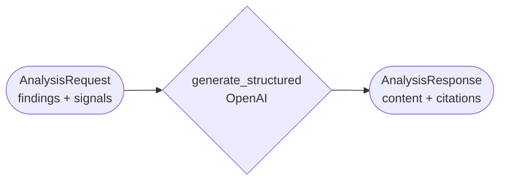

# Analyst

LangChain HTTPS service that synthesizes Researcher's findings and Market
Agent's signals into a detailed markdown analysis.

## Architecture



- `AI_MODE=fixture` (default): plain markdown synthesis, no API keys.
- `AI_MODE=live`: its own `analyst.llm_client.generate_structured`, prompted
  only from the request's own validated fields — including each source's
  full page text (`Source.content`), not just Researcher/Market's one-line
  claim/observation. The prompt asks for a thorough, uncapped markdown
  writeup (themes/insights/risks as prose), not a fixed number of bullets.
- Citation is by construction, not validation: the prompt shows a numbered
  list of sources and the model cites with bare `[N]` markers — there's no
  field for it to put a URL in, so it can't invent one. Code resolves each
  `N` against the real numbered `Source` list and rewrites `[N]` into a real
  markdown link (`render_citation_links`, shared via `packages/contracts`).
  The resulting `citations` (title/url/publisher, no content) is what
  reaches Writer — Writer never sees the full page text Analyst read.
- Never searches — no `tools.py` or Exa dependency.

## Configuration

`services/analyst/.env` (own copy): `AI_MODE`, `OPENAI_API_KEY`/`OPENAI_MODEL`,
`LLM_TIMEOUT_SECONDS`. No `EXA_*`.

## Run

```bash
uv run --package analyst uvicorn analyst.main:app --reload --port 8002  # standalone
docker compose up --build analyst                                       # full stack
uv run --package analyst pytest services/analyst/tests -v               # tests
```

`GET /health`, `GET /ready`, `POST /analyze`.
