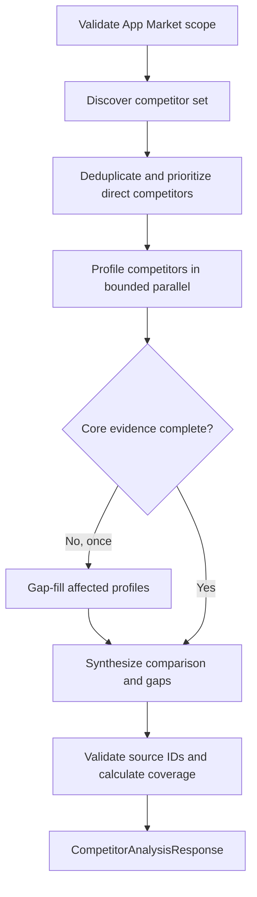

# Competitor Analyst

Google ADK competitor-analysis workflow served over gRPC. It accepts an App
Market query and returns grounded competitor profiles, cross-product analysis,
opportunity gaps, and the legacy signals consumed by the current orchestrator.

## Workflow



The reasoning phases are separate `LlmAgent` instances:

- Discovery searches category and product sources, then submits typed candidates.
- Profiling searches official and independent sources for one named competitor.
- Synthesis receives only grounded profiles and cannot search or create sources.
- The Python workflow owns concurrency, deadlines, deduplication, grounding,
  confidence, quality gates, and the single allowed gap-fill round.

All factual profile claims contain search-result tags. The service resolves those
tags to deterministic `src_*` IDs and rejects unknown references. Model-provided
URLs are never accepted. Opportunity gaps may reference only IDs already present
in the profile evidence registry.

## Contract Compatibility

The v1 protobuf response remains backward compatible:

- `competitive_signals` and `competitors` are still populated for the existing
  Orchestrator and Analyst.
- Additive `analysis` and `evidence` fields expose the complete structured result
  for future dashboard persistence.
- A partially profiled set returns `DEGRADED` with explicit warnings and coverage.

## Code Ownership

| File | Responsibility |
| --- | --- |
| `agent.py` | Phase-specific ADK agents and typed submit-tool extraction |
| `tools.py` | Request-local Exa search tool, source tags, call budgets |
| `models.py` | Strict phase input and grounded output models |
| `workflow.py` | Deterministic phases, concurrency, evidence, quality gates |
| `runner.py` | Provider error boundary and service result |
| `server.py` | gRPC validation, deadline, health and protobuf mapping |

Tracing preserves the distributed parent context and adds
`competitor_analysis.workflow`, `discover`, `profile`, `gap_fill`, and
`synthesize` business spans. ADK/LiteLLM continue to own model, token, cost,
provider, retry and fallback observations below these spans.

## Configuration

The service owns `services/competitor-analyst/.env`. Provider credentials remain
only in LiteLLM.

| Variable | Default | Purpose |
| --- | ---: | --- |
| `COMPETITOR_MAX_PROFILES` | 6 | Maximum selected competitor set |
| `DISCOVERY_SEARCH_CALLS` | 3 | Discovery search-tool budget |
| `PROFILE_SEARCH_CALLS` | 3 | Search budget per profile |
| `PROFILE_CONCURRENCY` | 3 | Maximum concurrent profiles |
| `MAX_GAP_FILL_ROUNDS` | 1 | Bounded repair passes |
| `DISCOVERY_TIMEOUT_SECONDS` | 45 | Discovery phase timeout |
| `PROFILE_TIMEOUT_SECONDS` | 45 | Timeout per profile |
| `SYNTHESIS_TIMEOUT_SECONDS` | 45 | Synthesis phase timeout |
| `LLM_MAX_OUTPUT_TOKENS` | 8000 | Maximum output per model call |

The Orchestrator competitor timeout defaults to 300 seconds. That covers the
bounded worst-case phase layout: one discovery, two profile waves, two gap-fill
waves, and synthesis, plus cancellation grace.

## Run

```bash
uv run --package competitor-analyst python -m competitor_analyst.server
docker compose up -d --build competitor-analyst orchestrator
uv run --package competitor-analyst pytest services/competitor-analyst/tests -q
```
