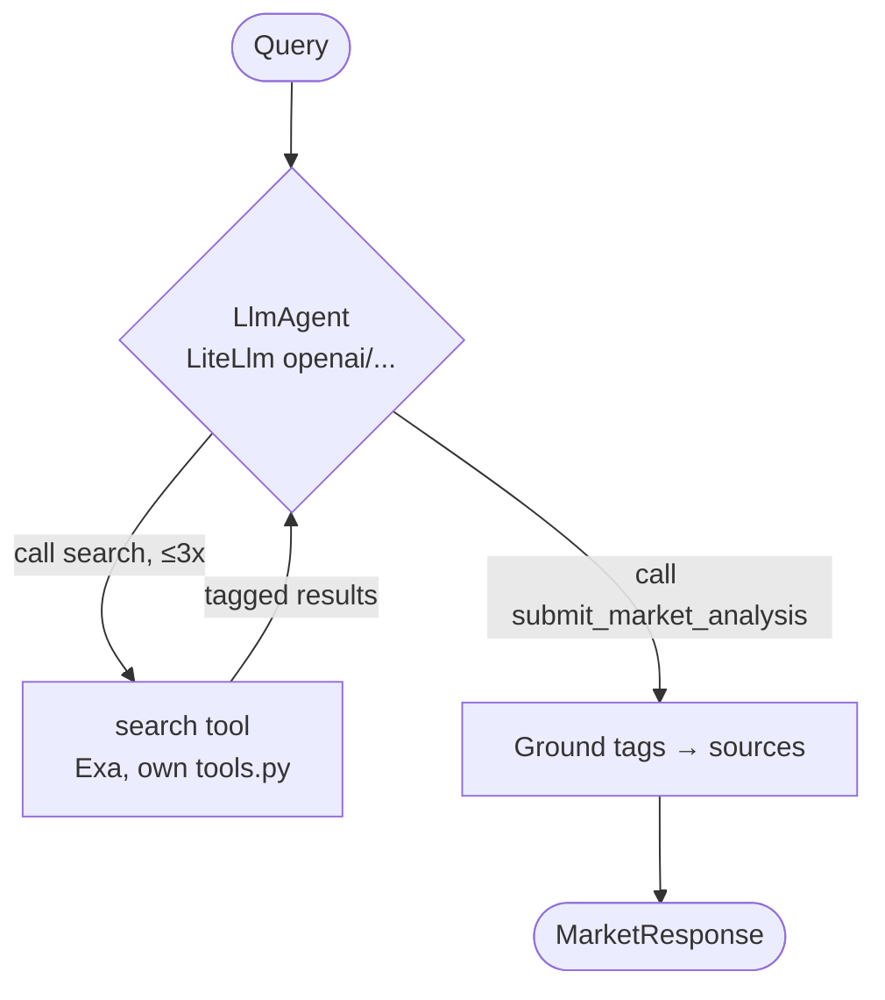

# Market Agent

Google ADK agent served over gRPC. `AI_MODE` switches between a
deterministic fixture and a real ReAct search agent behind the same
`MarketRequest`/`MarketResponse` contract.

## Architecture



- `AI_MODE=fixture` (default): two hardcoded signals, no API keys.
- `search` calls Exa directly — no shared code with Researcher; the tool
  self-enforces the 3-call budget (ADK has no built-in limiter).
- Signals cite a string tag (`function_call_id#position`); an unknown tag
  fails the run. The service builds every `Source` itself, never trusting
  model text.
- Final answer is a call to a synthetic `submit_market_analysis` tool, not
  `output_schema`, matching the tag-grounding pattern used by Researcher.
- ADK has no native OpenAI client — `LiteLlm` (backed by `litellm`) is the
  only supported bridge, so `litellm_langsmith.py` still instruments it
  even though there's a single provider.

| File | Responsibility |
| --- | --- |
| `agent.py` | `LlmAgent` construction + event extraction/grounding |
| `tools.py` | `search` tool + tag bookkeeping + call budget |
| `runner.py` | Fixture/live branch |
| `server.py` | gRPC servicer + health service |

## Configuration

`services/market-agent/.env` (own copy, not shared): `AI_MODE`,
`OPENAI_API_KEY`/`OPENAI_MODEL`, `EXA_API_KEY`,
`EXA_MAX_RESULTS`, `EXA_CONTENT_MAX_CHARACTERS`, `LLM_TIMEOUT_SECONDS`.

## Run

```bash
uv run --package market-agent python -m market_agent.server         # standalone, gRPC on :50051
docker compose up --build market-agent                               # full stack
uv run --package market-agent pytest services/market-agent/tests -v  # tests
```
