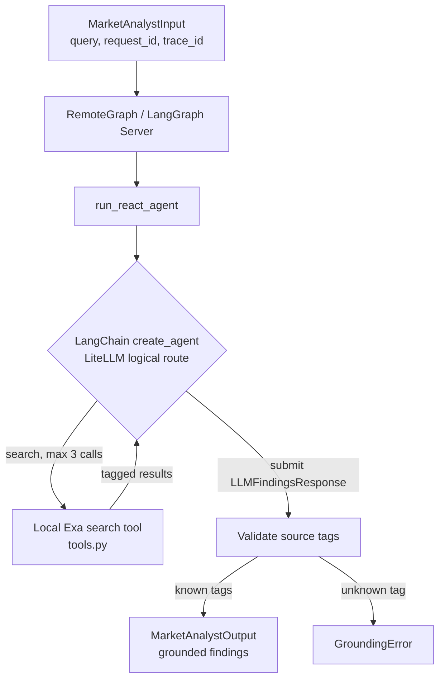

# Market Analyst

LangGraph service exposing two compatible graphs:

- `market_analyst`: the grounded-finding ReAct graph called by the
  orchestrator.
- `market_report_analyst`: the durable App Market workflow that collects evidence in
  parallel and publishes `market-analysis.v1` to the backend.

## Architecture



## Live ReAct Flow

```text
1. Orchestrator calls the `market_analyst` RemoteGraph with request and trace IDs.
2. `run_react_agent` creates a request-local LangChain agent and Exa tool.
3. The model decides whether to call `search`; middleware limits it to 3 calls.
4. Each search result receives a stable tag: {tool_call_id}#{position}.
5. The model submits `LLMFindingsResponse` containing only source tags.
6. Market Analyst resolves tags against tool messages and builds source objects itself.
7. Market Analyst returns a schema-validated `MarketAnalystOutput`; unknown tags fail.
```

- `search` calls Exa directly; no shared code with Competitor Analyst.
- Findings cite a string tag (`tool_call_id#position`); an unknown tag fails
  the run. The service builds every `Source` itself, never trusting model text.
- `ToolCallLimitMiddleware` caps search at 3 calls; the model submits via a
  synthetic `LLMFindingsResponse` tool call, not free text.
- The OpenAI-compatible `ChatOpenAI` client calls LiteLLM; provider selection
  and fallback are owned by the gateway.
- `request_id` and `trace_id` remain in the service contract for correlation.

| File | Responsibility |
| --- | --- |
| `graph.py` | LangGraph ReAct graph |
| `tools.py` | `search` tool + tag bookkeeping |
| `llm_schema.py` / `prompts.py` | Model-facing schema and prompt |
| `market_graph.py` | App Market planning, parallel research, gap fill, synthesis, and publication |
| `market_model.py` | Structured evidence extraction and dashboard synthesis through LiteLLM |
| `market_analysis.py` | Deterministic revenue normalization, scorecard, and lineage validation |
| `backend_client.py` | Authenticated, idempotent report publication |

## App Market Flow

```text
normalize -> plan -> optional approval interrupt
          -> research dimensions in parallel
          -> join evidence -> bounded gap fill
          -> structured synthesis -> deterministic validation
          -> idempotent backend publication
```

The seven research dimensions are market size, momentum, customers,
commercial dynamics, accessibility, competitors, and risks/opportunities.
Raw source excerpts remain bounded; model-produced facts must reference exact
source IDs before they can reach synthesis or persistence.

The Agent API and OpenAPI documentation are available at
`http://localhost:8001` and `http://localhost:8001/docs`. Open the LangGraph
Studio URL printed by the Market Analyst container and select `market_report_analyst`.
Its input schema is `AppMarketResearchInput`. Set `require_approval=true` to
add an approval gate before research starts. Every run with `publish=true`
always pauses again on the immutable report draft before publication. Set
`publish=false` to run analysis without creating a review draft or changing
dashboard data.

## Configuration

`services/market-analyst/.env` (own copy, not shared): `LLM_GATEWAY_BASE_URL`,
`LLM_GATEWAY_API_KEY`, `LLM_MODEL_ROUTE`, `EXA_API_KEY`, `EXA_MAX_RESULTS`,
`EXA_CONTENT_MAX_CHARACTERS`, `LLM_TIMEOUT_SECONDS`,
`LLM_MAX_OUTPUT_TOKENS`, `BACKEND_BASE_URL`, `BACKEND_INTERNAL_API_TOKEN`,
`BACKEND_TIMEOUT_SECONDS`, and `MARKET_SOURCE_EXCERPT_CHARACTERS`.

`langgraph dev` uses an in-memory local runtime. It supports graph interrupts
but does not survive container deletion. Use it only for short development
loops. Application evidence, immutable drafts, review history, and summaries
are persisted separately by the backend and survive either service restarting.

For a restart-safe local Agent Server, run the repository-level configuration
with `langgraph up`. The Agent Server owns its checkpointer and store; graph
code must not construct a production checkpointer itself. Use a dedicated
PostgreSQL database (or let the CLI create one) so graph checkpoints and
dashboard/domain records keep separate ownership:

```bash
uv run --package market-analyst --extra dev-server langgraph up \
  --api-version 0.14.0 \
  --config langgraph.market-analyst.json \
  --port 8001 --wait
```

The standalone Agent Server requires the LangGraph deployment license and
runtime environment variables documented by LangChain. The open-source graph
and direct tests remain checkpointer-agnostic; tests inject `InMemorySaver`.
The repository-level production config installs only the Pydantic contract
surface. gRPC and Protobuf remain dependencies of `competitor-analyst` and
`orchestrator`, so they cannot constrain the LangGraph API runtime image.

## Run

```bash
cd services/market-analyst
uv run --package market-analyst --extra dev-server langgraph dev --config langgraph.json --port 8001 --no-browser  # standalone
docker compose up --build market-analyst
uv run --package market-analyst pytest services/market-analyst/tests -v
```
