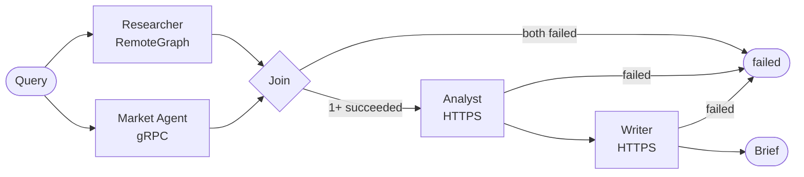

# Orchestrator

LangGraph control plane that fans a query out to Researcher and Market
Agent, joins their results, then runs Analyst → Writer. Owns no agent logic
and calls no AI provider — pure coordination over each service's contract.

## Architecture



- Join: both ok → `success`; one failed → `degraded` + warning; both failed
  → `failed`, Analyst never runs.
- Each agent call has its own timeout/retry (`AgentPolicy`, env-configurable).
- Workflow state is checkpointed to Postgres by `request_id`; replaying the
  same id returns the checkpointed result instead of re-running.
- Never holds provider keys — those live only in the services that call an
  AI provider.

| File | Responsibility |
| --- | --- |
| `graph.py` | Fan-out/join/sequence `StateGraph` |
| `nodes.py` | Per-agent node implementations |
| `clients/` | Per-transport clients (RemoteGraph, gRPC, HTTPS) |
| `retry.py` | Timeout/retry/backoff |
| `config.py` | `OrchestratorSettings` / `AgentPolicy` |
| `checkpointer.py` | Postgres checkpointer |

## Configuration

`RESEARCHER_URL`, `MARKET_AGENT_ADDRESS`, `ANALYST_URL`, `WRITER_URL`,
`CHECKPOINT_DATABASE_URL`, and per-agent
`<AGENT>_TIMEOUT_SECONDS`/`_MAX_ATTEMPTS`/`_BACKOFF_SECONDS` — see
`config.py` for defaults.

## Run

```bash
uv run --package orchestrator uvicorn orchestrator.main:app --reload   # standalone
docker compose up --build                                              # full stack
uv run --package orchestrator pytest services/orchestrator/tests -v    # tests
```

`GET /health`, `GET /ready`, `POST /workflows`.
