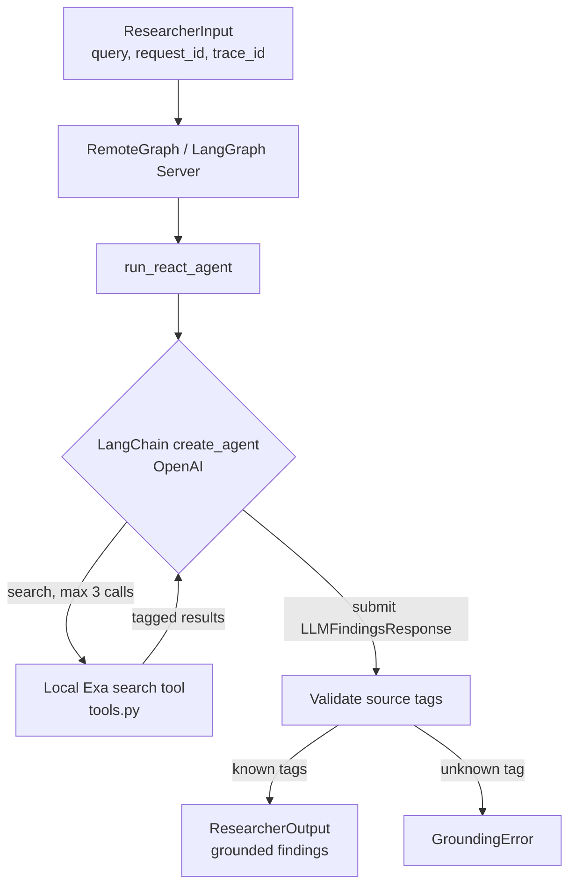

# Researcher

LangGraph research agent, served as a `RemoteGraph` (`langgraph dev`) that
the Orchestrator calls directly. `AI_MODE` switches between a deterministic
fixture and a real ReAct search agent behind the same
`ResearcherInput`/`ResearcherOutput` contract.

## Architecture



## Live ReAct Flow

```text
1. Orchestrator calls the `researcher` RemoteGraph with request and trace IDs.
2. LangGraph Server accepts the LangSmith distributed-trace context.
3. `run_react_agent` creates a request-local LangChain agent and Exa tool.
4. The model decides whether to call `search`; middleware limits it to 3 calls.
5. Each search result receives a stable tag: {tool_call_id}#{position}.
6. The model submits `LLMFindingsResponse` containing only source tags.
7. Researcher resolves tags against tool messages and builds source objects itself.
8. Researcher returns a schema-validated `ResearcherOutput`; unknown tags fail.
```

- `AI_MODE=fixture` (default): two hardcoded findings, no API keys.
- `search` calls Exa directly — no shared code with Market Agent.
- Findings cite a string tag (`tool_call_id#position`); an unknown tag fails
  the run. The service builds every `Source` itself, never trusting model text.
- `ToolCallLimitMiddleware` caps search at 3 calls; the model submits via a
  synthetic `LLMFindingsResponse` tool call, not free text.
- OpenAI via `langchain_openai.ChatOpenAI`.
- LangSmith trace context travels from Orchestrator through `RemoteGraph`;
  the Researcher branch contains `researcher → run_react_agent → model/search`.

| File | Responsibility |
| --- | --- |
| `graph.py` | Fixture/live graphs |
| `tools.py` | `search` tool + tag bookkeeping |
| `llm_schema.py` / `prompts.py` | Model-facing schema and prompt |

## Configuration

`services/researcher/.env` (own copy, not shared): `AI_MODE`,
`OPENAI_API_KEY`/`OPENAI_MODEL`, `EXA_API_KEY`,
`EXA_MAX_RESULTS`, `EXA_CONTENT_MAX_CHARACTERS`, `LLM_TIMEOUT_SECONDS`.

## Run

```bash
cd services/researcher
uv run --package researcher langgraph dev --config langgraph.json --port 8001 --no-browser  # standalone
docker compose up --build researcher                                                        # full stack
uv run --package researcher pytest services/researcher/tests -v                             # tests
```
