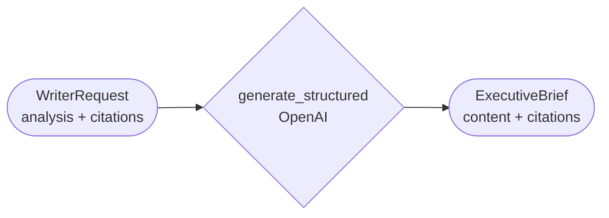

# Writer

HTTPS service that turns Analyst's markdown analysis into the final
executive brief.

## Architecture



- `AI_MODE=fixture` (default): wraps Analyst's markdown with a title, no
  API keys.
- `AI_MODE=live`: its own `writer.llm_client.generate_structured`, prompted
  with Analyst's `analysis` text and the numbered `citations` it can cite.
  Asked for a complete, detailed markdown brief (title, summary, insights,
  recommendations as prose/sections) — not a fixed number of bullets.
- Cannot see raw research — `WriterRequest` has no `research_findings` or
  `market_signals` fields, and `citations` are content-free (title/url/
  publisher only), never the full source pages Analyst read. Structural,
  not just by prompt wording.
- Citation is by construction, not validation: the model cites with bare
  `[N]` markers against the numbered citations it was shown — there's no
  URL field for it to invent one in. Code rewrites `[N]` into a real
  markdown link (`render_citation_links`, shared via `packages/contracts`).
- `content` is markdown (headings, bold, lists) — the frontend renders it
  as markdown rather than plain text; the inline citation links carry a
  native hover tooltip.

## Configuration

`services/writer/.env` (own copy): `AI_MODE`, `OPENAI_API_KEY`/`OPENAI_MODEL`,
`LLM_TIMEOUT_SECONDS`. No `EXA_*`.

## Run

```bash
uv run --package writer uvicorn writer.main:app --reload --port 8003  # standalone
docker compose up --build writer                                      # full stack
uv run --package writer pytest services/writer/tests -v               # tests
```

`GET /health`, `GET /ready`, `POST /write`.
